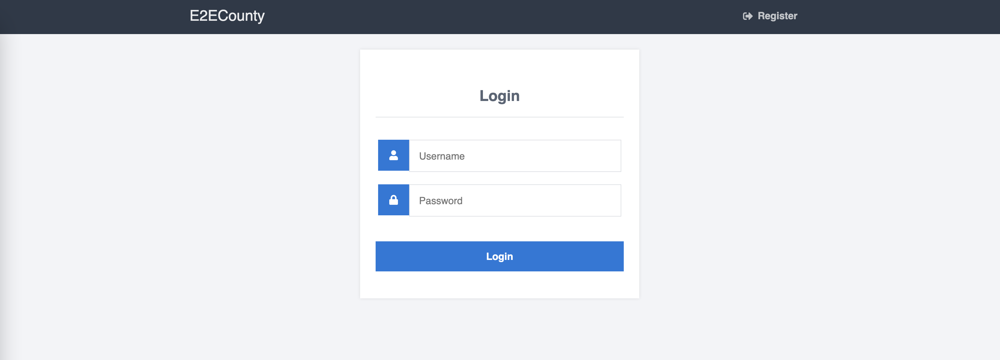
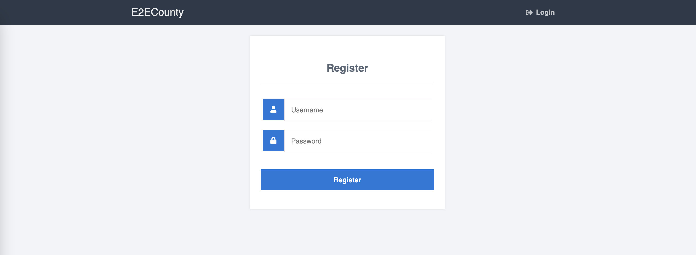

### Features

- Login
- Register
- Roles
- Hashed Password
- PHP PDO

# Login / Registeration System

     

#Installation
- Upload database.sql into your webserver.
- Change database server information in app/databaseClass.php:47

#Admin Demo Account
- **Username:** admin
- **Password:** 123456

#User Demo Account
- **Username:** test
- **Password:** 123456

# Screenshots

###End
